# DbCodeGen 代码生成器

数据库驱动的智能代码生成桌面工具（.NET 8 WPF，开源）。

把「表元数据 × 模板 × 输出路径」串成一条自动化流水线：**多选表 → 模板包渲染 → dry-run 预览 → 安全写盘**。并内置完整 AI 能力，从零写模板、改模板、把其他生成器的模板迁移过来，全都可以自动完成。

## 核心特性

### 多数据源

- 同时管理 **MySQL / PostgreSQL** 多套连接，密码经 Windows DPAPI 加密保存
- 工具栏一键切换当前连接，数据源管理窗口支持新增 / 编辑 / 测试连接 / 删除
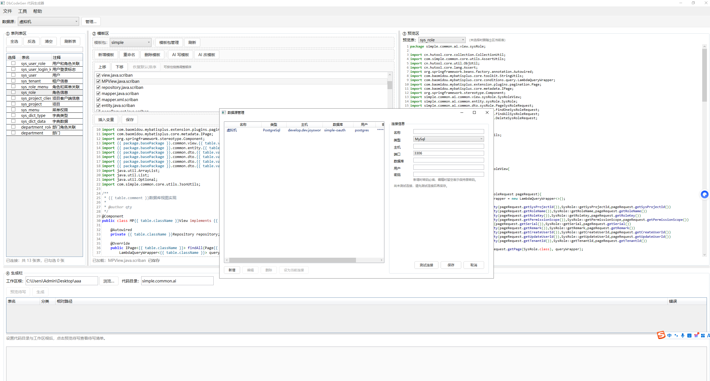
### 多项目、多模板组

- **多项目**：工作区根 + 代码目录双配置，一套工具管理多个项目的代码输出，最近目录自动记忆
- **多模板组（模板包）**：内置模板包与用户模板包并存，zip 导入 / 导出分享；模板包与包内文件均支持拖拽 / 上移下移排序，即时持久化、一键恢复默认
- **勾选到层**：每个模板文件可独立勾选，精确控制参与批量生成的文件集合
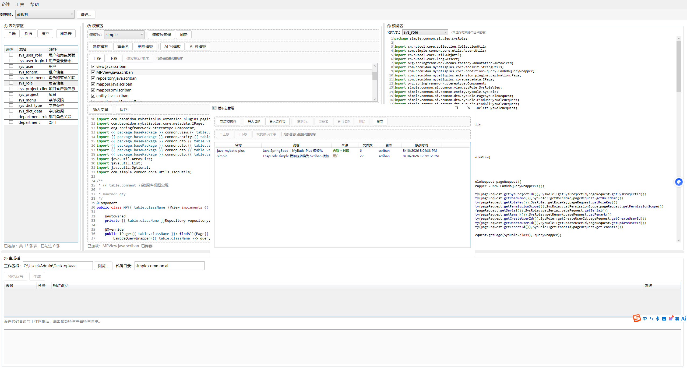
### 模板编辑与实时预览

- 内嵌 AvalonEdit 编辑器，按目标语言自动语法高亮
- 变量面板双击插入 `{{变量}}` 表达式，修改模板即时预览真实渲染结果，渲染错误精确定位到行列
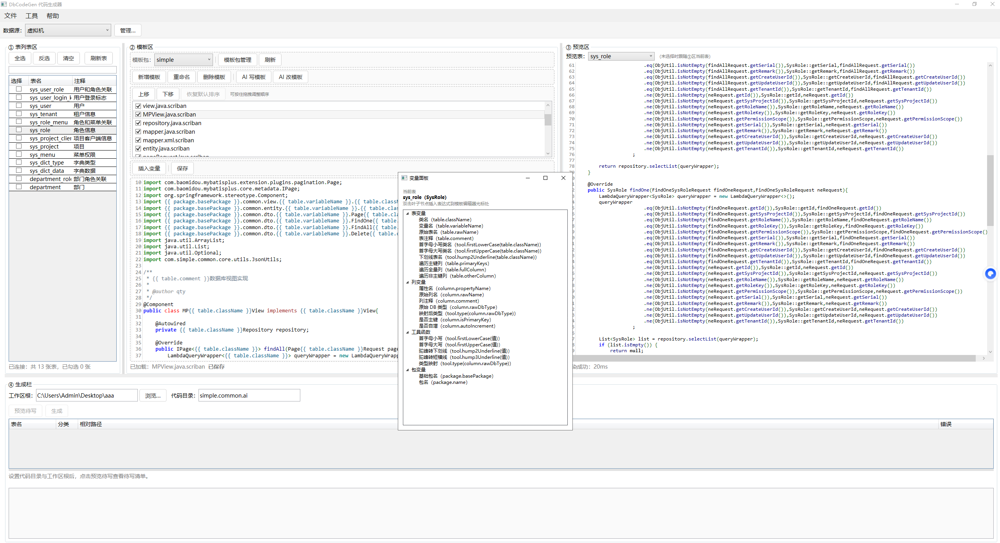
### 批量代码生成

- 多选表 × 模板包 → 渲染 → dry-run 预览（新增 / 覆盖 / 跳过分类）→ 确认后安全写盘
- 支持输出到 `src/main/resources` 等代码根外目录（`../` 越级），生成日志全程记录
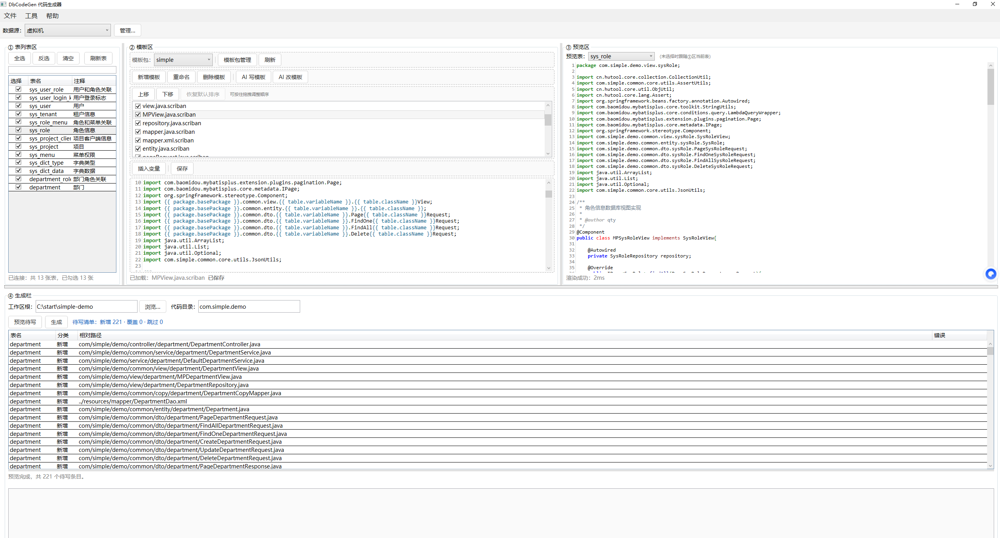
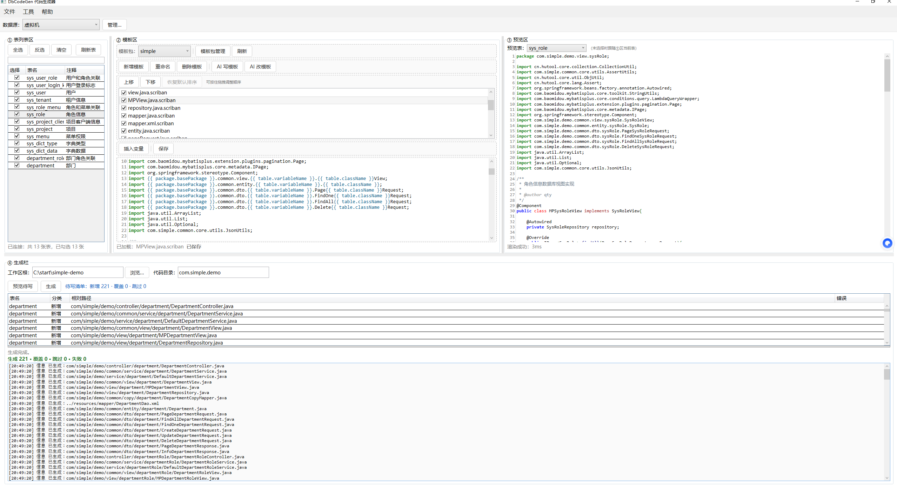
### AI 写模板（全自动）

- 一句话描述技术栈 + 选一个样例表 +（可选）参考文件 → AI 自动生成整套模板包，生成时间会比较久，耐心等待即可
- 生成内容经完整性校验后一键落库，支持新建模板包或追加到现有用户包

### AI 迁移其他生成器模板（零配置）

- 把 EasyCode / 其他生成器的 Velocity、FreeMarker 模板，或现有项目的代码，直接作为参考文件上传
- AI 自动把 Velocity 语法翻译成 Scriban，逐文件镜像文件名与相对结构，输出代码风格、注解、import、包结构保持一致
- **无需任何手工配置**，即可把其他生成器的整套模板迁移到本软件
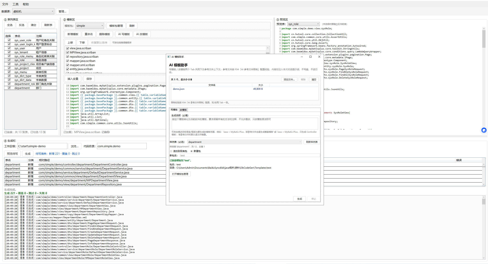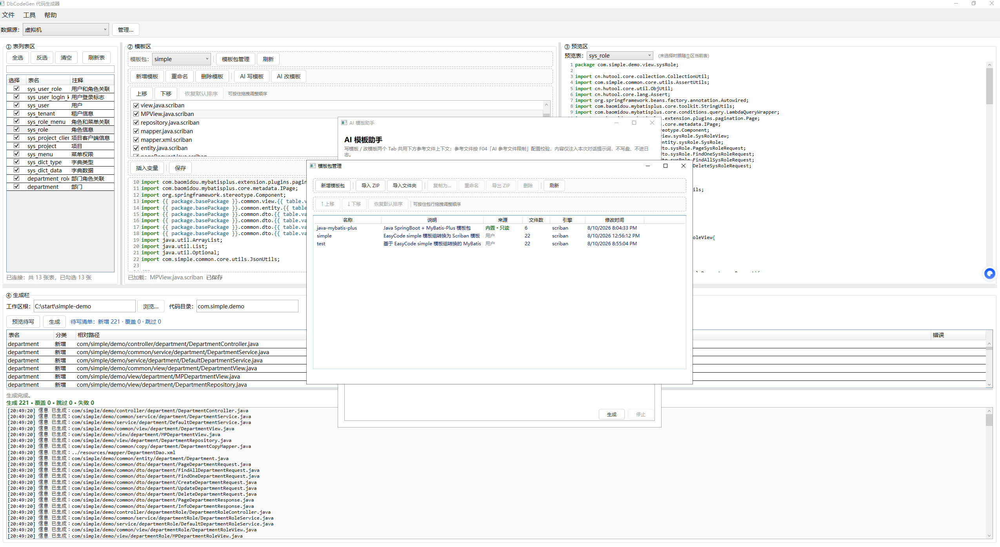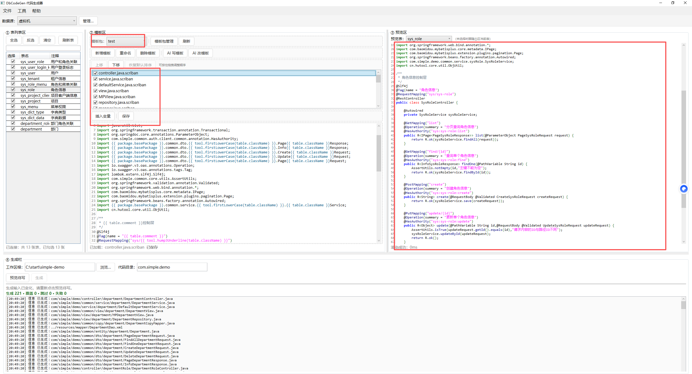

### AI 改模板（对话式）

- 选中模板后直接对话修改，AI 返回完整新文件，一键「应用到编辑器」，继续走预览 / 保存链路
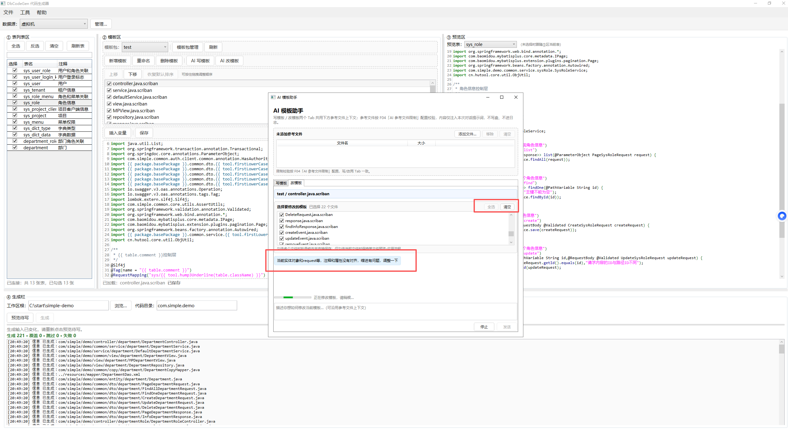

### 类型映射

- 数据库类型 → 目标语言类型全局映射，支持包级 typeMap 覆盖与兜底规则，JSON 导入 / 导出
- 生成前自动预检未映射类型
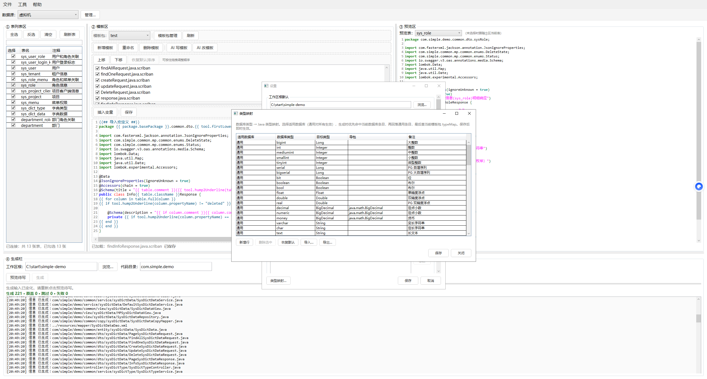
### SQL 执行面板

- 内置 SQL 执行器，支持命令超时与结果行数上限
- 危险语句检测：DROP / TRUNCATE / 无 WHERE 的 DELETE·UPDATE 执行前二次确认
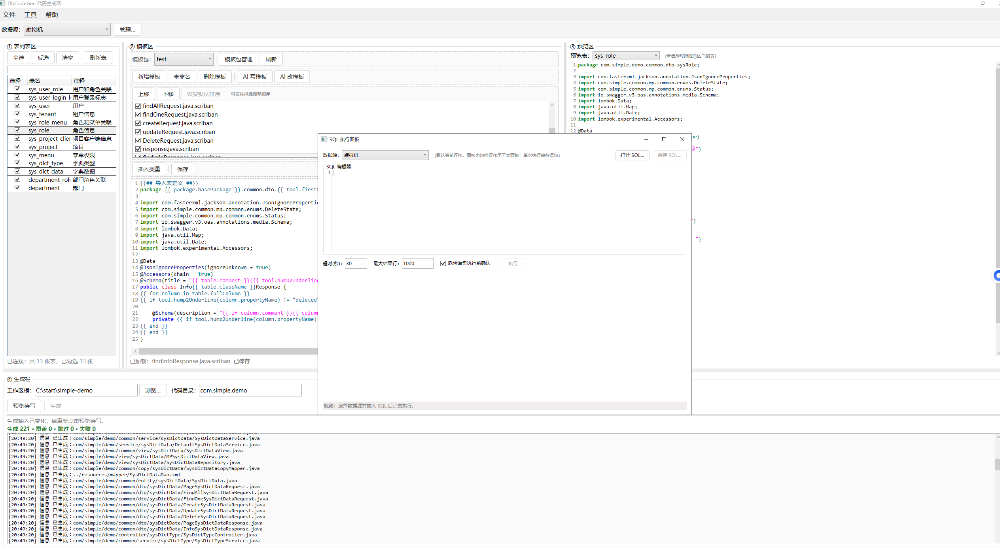
### 备份 / 恢复

- 全部配置一键打包成 `.dbcg` 文件，换电脑迁移零成本

## AI 能力

- 基于 OpenAI 兼容协议直连，默认通义千问（DashScope 兼容端点），兼容 DeepSeek / 智谱 / Kimi / OpenAI 等模型
- API Key 经 Windows DPAPI 加密保存，明文不落盘、不落日志
- 支持测试连接与模型下拉刷新
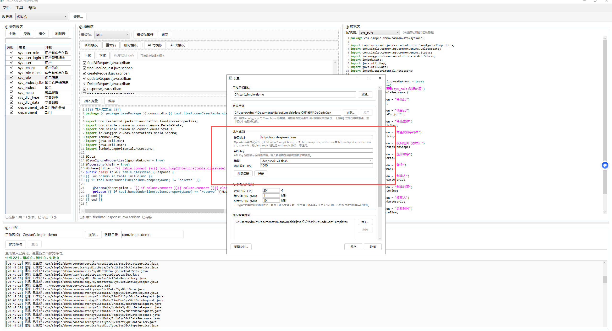
## 快速开始

1. 「工具 → 数据源管理」添加 MySQL / PostgreSQL 连接，或直接在工具栏选择
2. ① 表列表区勾选要生成代码的表
3. ② 模板区选择一个模板包（没有合适的模板？用「AI 写模板」生成一套）
4. ④ 生成栏配置工作区根与代码目录，点「预览待写」核对、点「生成」写盘
